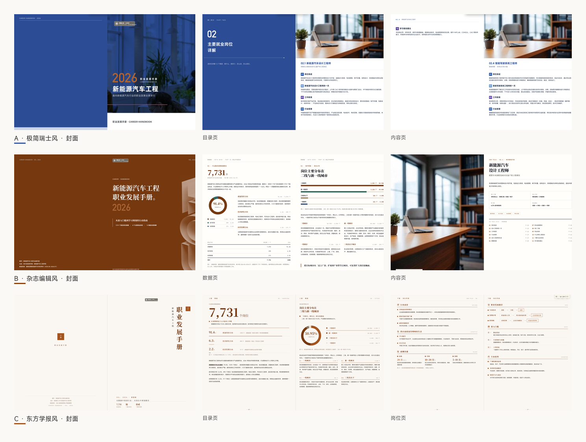

# edu-print-handbook-skill

<p align="center">
  一套<strong>版式锁死</strong>的高校印刷品生成系统：**一套内容模型（JSON）+ 三套视觉风格**，以 Claude Code / opencode Skill 形式交付。

生成**单文件 HTML** 可打印分页手册：210×285 大16开单页，打印对开 420×285 拼版（含 3mm 出血），`@media print` 直接「另存为 PDF」得到对开成品。屏幕纵向滚动一屏一卡，打印逐对开输出，屏幕所见 = 打印所得。

换专业只换「内容清单 JSON + 主题色 token」，换风格只换发起词——页面物理规格、骨架、图表纪律全部不变。

## 三套风格（按「风格关键词」路由）

| 风格 | 触发词 | 骨架 | 气质 |
|---|---|---|---|
| **A · 简洁教育 × 极简瑞士风** | 瑞士风 / 简洁 / 极简 / 干净 / minimal / swiss | L00–L11 | 无衬线、直角纯色、hairline、单一 accent、极致留白 |
| **B · 杂志编辑风**（默认） | 杂志 / 编辑风 / editorial / magazine / 图文混排 / 文章式 / 无风格词默认 | M00–M17 | 刊头 masthead、衬线大标题、pull-quote、folio 眉脚 |
| **C · 东方学报风** | 学报 / 书院 / 东方 / 竖排 / 宋体 / 宣纸 / 印章 / journal | X00–X18 | 宣纸底 + 墨色正文 + 朱砂唯一点缀、竖排目录、印章、文武线 |

<p align="center">
  
</p>

三套共用同一内容模型与物理规格，同一份内容 JSON 可在三套间互转（`meta.std=0.1` 结构同族），区别只在视觉层。三套共用 9 套预设主题色板（`_shared/themes.md`，hex+CMYK 双值，第 9 套「朱砂」为 C 专属）。

## 目录结构

```
edu-print-handbook-skill/
├── SKILL.md                 ← 风格路由 + 通用纪律（Skill 入口）
├── PLAN.md                  ← 三风格实施计划
├── _shared/                 ← 三套共用，勿复制
│   ├── fonts/               ← 可商用字体（见 fonts/README.md 版权声明）
│   ├── placeholders/        ← 中性占位校徽（logo-placeholder.svg）
│   └── themes.md            ← 9 套主题色板（hex + CMYK）
└── templates/
    ├── A-career/            ← 模版 A（瑞士风）：README + assets/template.html + references/ + scripts/ + content/
    ├── B-editorial/         ← 模版 B（杂志风）：同上
    └── C-journal/           ← 模版 C（学报风）：同上
```

每个模版目录**自包含**：`assets/template.html`（单文件种子，类名唯一来源）、`references/`（layouts 骨架库 + checklist）、`scripts/`（build + validate）、`content/`（示例 JSON）。

## 快速开始

```bash
# 1. 写内容清单 JSON（参考 templates/<X>/content/example-xinnengyuan.json）
# 2. 构建
node templates/B-editorial/scripts/build-magazine.mjs \
  templates/B-editorial/content/example-xinnengyuan.json \
  ./新能源汽车工程-职业发展手册.html
# 3. 校验（0 错误才算过）
node templates/B-editorial/scripts/validate-magazine.mjs \
  ./新能源汽车工程-职业发展手册.html
# 4. 浏览器打开 → 另存为 PDF → 核对 432×291mm 对开拼版
open ./新能源汽车工程-职业发展手册.html
```

完整工作流（澄清 → 选主题 → 写 JSON → 构建 → 校验 → checklist 自检 → 打印核对）见各模版 `README.md` 与 `SKILL.md`。

## 字体版权声明

内置字体均为可商用字型：MiSans、Alibaba PuHuiTi 3、IBM Plex Mono、Noto Serif SC。来源与许可明细见 **[`_shared/fonts/README.md`](_shared/fonts/README.md)**——随仓库发布请保留该文件。

## 镜像分享说明

本仓库可安全公开分享（镜像 / 同行评审 / 教学演示）：

- 三套模版内置的是**中性占位校徽**（`_shared/placeholders/logo-placeholder.svg`）与**仅作版式演示的示例插图**（各模版 `content/example-*.json` 引用的 `images/` 配图）。
- **正式交付或送印前必须替换**：① 占位校徽 → 真实校徽（A/B 白色版、C 墨色单色版）；② 示例插图 → 真实岗位 / 场景照片（全出血 ≥ 300dpi，插图 ≥ 200dpi）。
- 各模版 `README.md` Step 4 与 `references/checklist.md` 的 P0 项均包含该替换检查。

## 参考作品

- 新能源汽车工程 · 职业发展手册（三模版示例，各 20–22 页）
- 风格参考：Josef Müller-Brockmann 网格系统 / The New York Times Magazine 栏目系统 / 中华书局古籍版式
